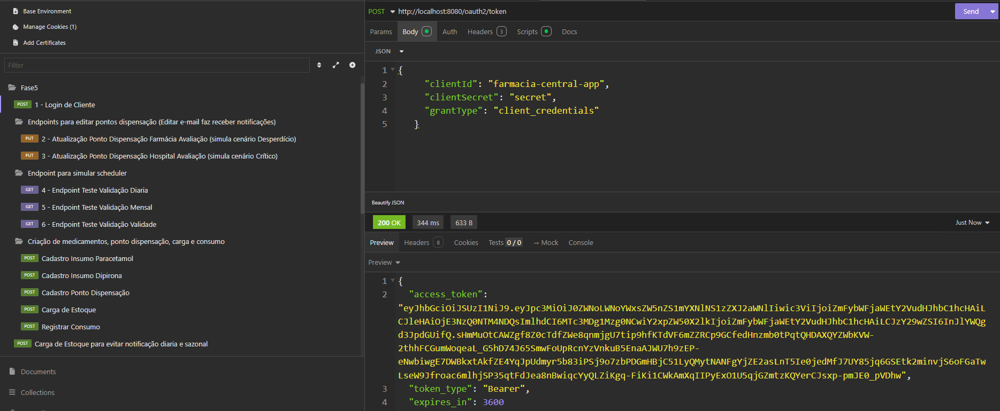
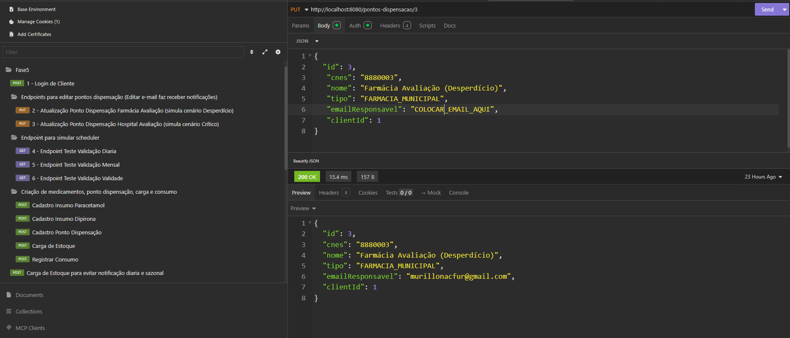
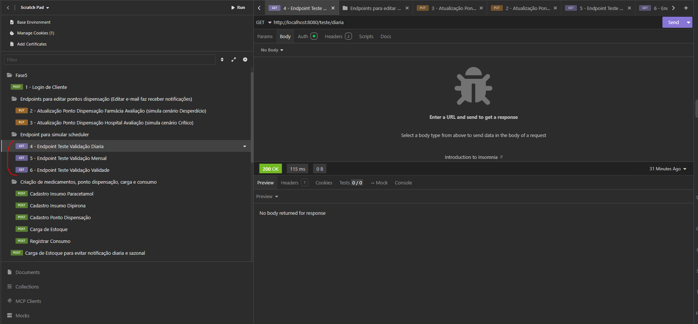

# Guia de Testes

Este guia mostra como testar o fluxo principal, desde a autenticação até os endpoints que simulam os schedulers rodando.
---
**Obs.:** Para facilitar os testes, um script com uma carga de dados simulando o uso real de alguns pontos de dispensação foi inserido via Liquibase.
O script `01_cenario_avaliacao_fevereiro_2026.sql` pode ser encontrado na pasta `src/main/resources/db/changelog/`.

### Passo 1: Rodar a aplicação via Docker Compose

Para iniciar a aplicação e o banco de dados PostgreSQL, execute o seguinte comando na raiz do projeto:

```bash
docker-compose up -d
```

Aguarde alguns instantes até que os containers estejam ativos. A aplicação estará disponível em `http://localhost:8080`.

### Passo 2: Importar a collection

Duas collections de teste estão disponíveis para importação: uma para Postman e outra para Insomnia. Ambas contêm as requisições necessárias para testar o fluxo completo da aplicação.

Postman: [Collection Fase5.postman_collection.json](collections/Collection%20Fase5.postman_collection.json)

Insomnia: [collection - Insomnia_2026-02-10 - fase5.yaml](collections/collection%20-%20Insomnia_2026-02-10%20-%20fase5.yaml)

### Passo 3: Autenticação (Obter Token)

Primeiro, vamos obter um token de acesso do cliente de teste que foi inserido pelo script via Liquibase.



**Obs.:** O token gerado já será atribuído às outras requisições, portanto não é necessário copiar o token para as próximas etapas.

---

### Passo 4: Alterar os pontos de dispensação

Na pasta "Endpoints para editar pontos dispensação (Editar e-mail faz receber notificações)", existem requisições para alterar os pontos de dispensação.
A ideia aqui é utilizarmos pontos de dispensação existentes (com a carga de dados já feita) e alterarmos os e-mails dos responsáveis para o e-mail de quem estiver validando a solução.



Aqui temos dois pontos de dispensação a alterar, pois um deles irá testar os cenários de falta de medicamentos tanto diária quanto sazonal e sugestão de remanejamento, e o outro o cenário de medicamentos com data de validade próxima.

### Passo 5: Simular gatilho do scheduler

Na pasta "Endpoint para simular scheduler", temos três requisições para simular o gatilho do scheduler, cada uma delas para um cenário diferente:
- **Cenário 1:** Validação diária, olhando para a média de consumo dos últimos 30 dias.
- **Cenário 2:** Validação sazonal, olhando para a média de consumo do próximo mês nos últimos anos.
- **Cenário 3:** Validação de proximidade de data de validade, olhando para os medicamentos que estão com a data de validade próxima.



Após consumir cada um destes endpoints, serão gerados e-mails de notificações para os gestores dos pontos de dispensação afetados. Cada e-mail conterá uma sugestão de remanejamento, de compra ou um alerta de validade próxima.
